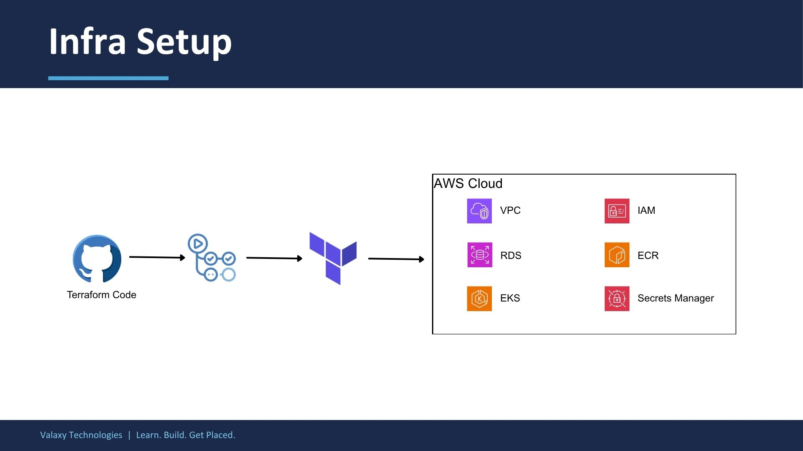

# Assignment: Cloud Infrastructure Provisioning with Terraform & GitHub Actions

## Overview

In this assignment you will provision a production-grade cloud infrastructure on AWS using Terraform and automate it end-to-end with a GitHub Actions CI/CD pipeline. The reference implementation is the **zen-infra** repository.

By the end of this assignment you will have:

- A multi-environment AWS infrastructure (Dev, QA, Prod) managed entirely by Terraform
- Reusable Terraform modules shared across all environments
- Remote state stored securely in S3 with locking
- A GitHub Actions pipeline that plans, applies, and destroys infrastructure with proper gate controls

---

## Architecture Diagram



### What You Will Build

```
AWS Account
└── us-east-1
    ├── VPC
    │   ├── Public Subnets        — NAT Gateway, Load Balancers
    │   ├── Private EKS Subnets   — EKS worker nodes
    │   └── Private RDS Subnets   — RDS PostgreSQL
    │
    ├── EKS Cluster
    │   └── Managed Node Group
    │
    ├── RDS PostgreSQL
    │   └── Private subnet, encrypted, accessible only from EKS
    │
    ├── ECR Repositories
    │   ├── api-gateway
    │   ├── auth-service
    │   ├── drug-catalog-service
    │   ├── inventory-service
    │   ├── manufacturing-service
    │   ├── notification-service
    │   ├── pharma-ui
    │   └── supplier-service
    │
    ├── IAM
    │   ├── EKS cluster role
    │   ├── EKS node group role
    │   └── GitHub Actions OIDC role (no static credentials)
    │
    └── Secrets Manager
        ├── DB credentials
        └── Application secrets (e.g. JWT secret)
```

### CI/CD Flow

```
Feature branch
    │
    ▼
Pull Request → terraform fmt + validate + plan  (runs automatically)
    │
    ▼
Merge to main → plan → Approval gate → apply
    │
    ▼
Infrastructure updated in AWS
```

---

## Repository Structure to Produce

```
zen-infra/
├── .github/
│   ├── dependabot.yml
│   └── workflows/
│       └── terraform.yml
│
├── envs/
│   ├── dev/
│   │   ├── backend.tf
│   │   ├── providers.tf
│   │   ├── main.tf
│   │   ├── variables.tf
│   │   └── outputs.tf
│   ├── qa/           (mirrors dev)
│   └── prod/         (mirrors dev)
│
└── modules/
    ├── vpc/
    ├── eks/
    ├── rds/
    ├── ecr/
    ├── iam/
    └── secrets-manager/
```

---

## Requirements

### Section 1 — Repository & Git Workflow (15 points)

| # | Requirement | Points |
|---|---|---|
| 1 | **Protected main branch** — Enable branch protection on `main` in GitHub repository settings: require at least one PR review before merging and disallow direct pushes (including from admins) | 5 |
| 2 | **All changes via Pull Request** — All code changes must be introduced via a feature branch and a Pull Request targeting `main`; running `git push origin main` directly must be rejected by GitHub | 5 |
| 3 | **Apply only runs from main — never from feature branches** — The pipeline `apply` job must only execute when a commit is pushed to `main` (i.e. a PR is merged) or when manually triggered via `workflow_dispatch`; opening or updating a PR must only trigger `terraform plan`, never `terraform apply` | 5 |

---

### Section 2 — Terraform Code Structure (25 points)

| # | Requirement | Points |
|---|---|---|
| 4 | **Three separate environments — Dev, QA, Prod** — Each environment under `envs/<env>/` with its own `backend.tf`, `providers.tf`, `main.tf`, `variables.tf`; environment-specific values set per env | 5 |
| 5 | **Reusable Terraform modules** — All infrastructure logic lives in `modules/`; environments call the same modules with different inputs; each module has `variables.tf` and `outputs.tf` | 10 |
| 6 | **Remote state with S3 backend and locking** — Each environment has its own state file key (e.g. `envs/dev/terraform.tfstate`); encryption enabled; state locking enabled (S3 native locking requires Terraform ≥ 1.10, no DynamoDB needed) | 5 |
| 7 | **Consistent resource tagging** — Every AWS resource tagged with at minimum `Name`, `Env`, and `Project`; tags derived from module input variables, not hardcoded | 5 |

---

### Section 3 — AWS Infrastructure (25 points)

| # | Requirement | Points |
|---|---|---|
| 8 | **VPC with public and private subnets** — Public subnets for NAT Gateway and Load Balancers; private EKS subnets for worker nodes; private RDS subnets for database; Internet Gateway, NAT Gateway, and route tables wired correctly | 6 |
| 9 | **EKS cluster with managed node group** — Cluster with configurable Kubernetes version; node group with min/desired/max scaling; OIDC provider created for IRSA support | 6 |
| 10 | **RDS PostgreSQL in private subnet** — Accessible only from EKS security group; encryption at rest enabled; deployed in private RDS subnets only | 5 |
| 11 | **ECR repositories** — Create one ECR repository for each of the 8 services: `api-gateway`, `auth-service`, `drug-catalog-service`, `inventory-service`, `manufacturing-service`, `notification-service`, `pharma-ui`, `supplier-service`; must exist in all three environments | 4 |
| 12 | **IAM roles with least-privilege policies** — Separate IAM roles for EKS cluster and node group; only required managed policies attached | 2 |
| 13 | **AWS Secrets Manager** — DB credentials and application secrets stored in Secrets Manager; no secrets hardcoded in `.tf` files or committed to git | 2 |

---

### Section 4 — GitHub Actions CI/CD Pipeline (35 points)

| # | Requirement | Points |
|---|---|---|
| 14 | **Terraform format and validate on every run** — `terraform fmt -check -recursive` enforces formatting; `terraform validate` catches config errors before plan | 5 |
| 15 | **Terraform Plan runs automatically on every Pull Request** — Pipeline triggers on `pull_request` targeting `main`; plan output visible in pipeline logs | 5 |
| 16 | **Save plan artifact and reuse for apply** — `tfplan` binary uploaded as a pipeline artifact after plan; apply job downloads and applies the exact saved plan — does not re-run plan | 8 |
| 17 | **Manual approval gate before Terraform Apply** — Apply only runs on push/merge to `main`; uses a GitHub Environment with required reviewers; pipeline pauses until a reviewer approves | 8 |
| 18 | **Manual approval gate before Terraform Destroy** — Destroy only via `workflow_dispatch`; requires a typed confirmation input (user must type `"destroy"`); also uses an environment approval gate | 5 |
| 19 | **Prevent concurrent Terraform runs** — Pipeline concurrency group scoped per branch (`terraform-${{ github.ref }}`); `cancel-in-progress: false` so runs wait rather than cancel (prevents state corruption) | 4 |

---

### Section 5 — Operational Maturity (Bonus — 10 points)

| # | Requirement | Points |
|---|---|---|
| 20 | **Path-based pipeline triggers** — Pipeline only triggers when files under `envs/**` or `modules/**` change; README or docs changes do not trigger a run | 5 |
| 21 | **Manual workflow dispatch support** — `workflow_dispatch` input allows triggering plan, apply, or destroy manually from the GitHub Actions UI; destroy requires both action selection and typed confirmation | 5 |

---

## Grading Summary

| Section | Points |
|---|---|
| Section 1 — Repository & Git Workflow | 15 |
| Section 2 — Terraform Code Structure | 25 |
| Section 3 — AWS Infrastructure | 25 |
| Section 4 — GitHub Actions CI/CD Pipeline | 35 |
| **Total** | **100** |
| Section 5 — Operational Maturity (Bonus) | +10 |

---

## Submission Checklist

Before submitting, verify the following:

- [ ] `main` branch is protected with required PR reviews
- [ ] All three environments (`dev`, `qa`, `prod`) exist under `envs/`
- [ ] All Terraform logic is in modules under `modules/`; environments only call modules
- [ ] Each environment has its own `backend.tf` pointing to a separate S3 state key
- [ ] `terraform fmt -check` passes with no errors
- [ ] `terraform validate` passes for each environment
- [ ] GitHub Actions pipeline runs `plan` automatically on every PR to `main`
- [ ] Apply requires a merged PR + environment approval gate
- [ ] Destroy requires `workflow_dispatch` with typed confirmation + environment approval gate
- [ ] No secrets or passwords committed to the repository
- [ ] All AWS resources are tagged with `Name`, `Env`, and `Project`

---

## Notes

- You are expected to fork this repository and implement the infrastructure in your own AWS account.
- Refer to the `README.md` in this repository for step-by-step setup instructions including AWS account setup, S3 backend creation, GitHub Secrets configuration, and GitHub Environment setup.
- Use Terraform version **1.10.0 or higher** (required for S3 native state locking).
- All costs incurred on your AWS account are your responsibility. Destroy the infrastructure when not in use.
